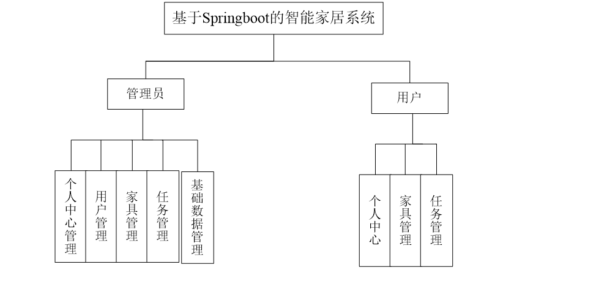
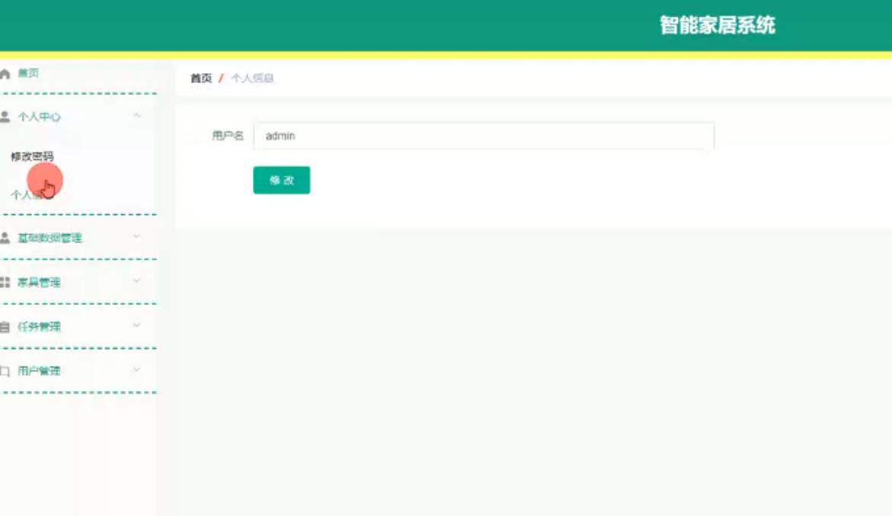
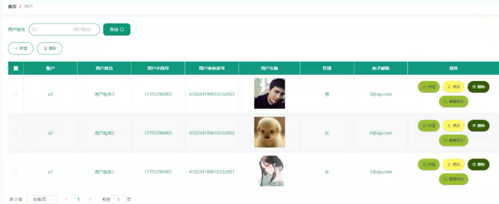
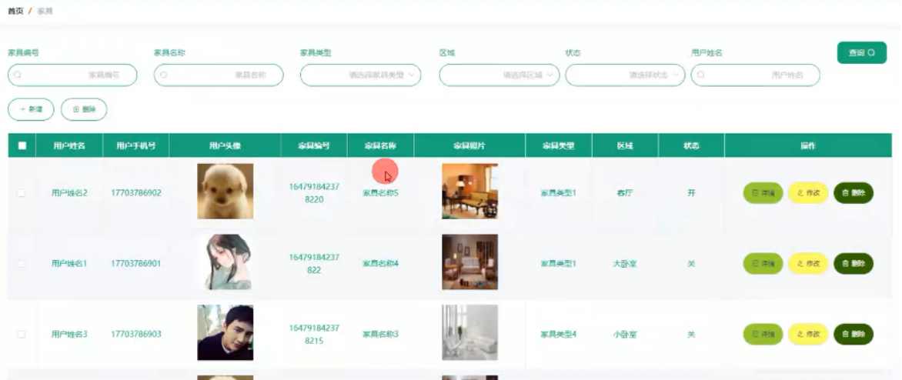
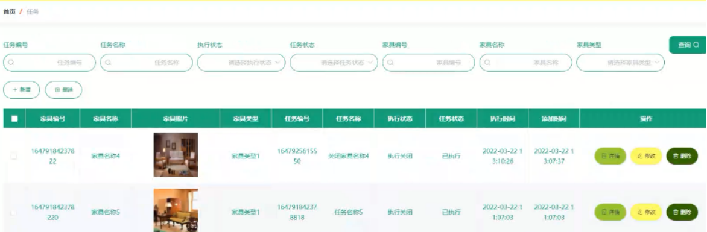
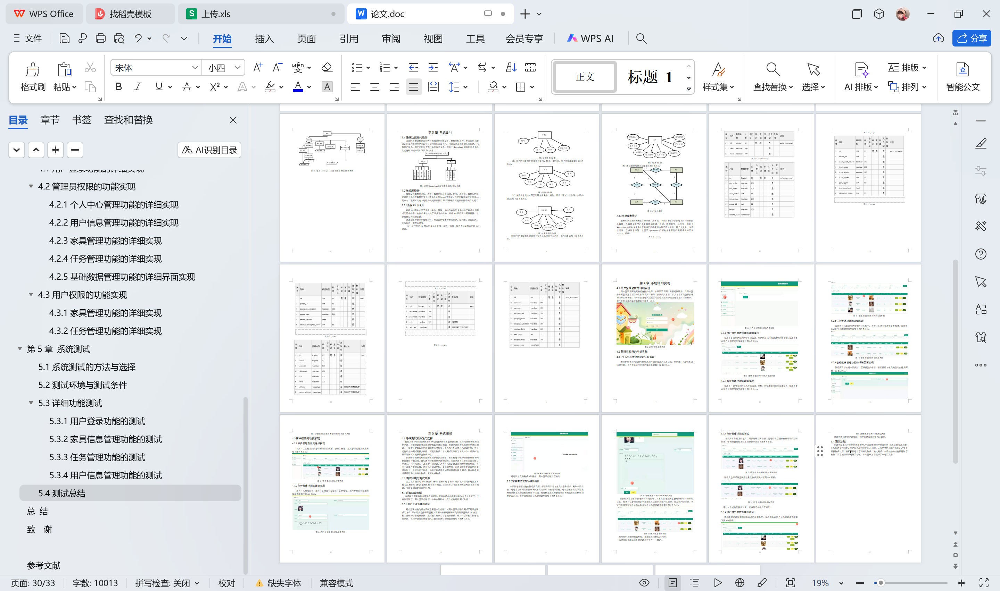

# springboot100-基于SpringBoot的智能家居系统

>  博主介绍：
>  Hey，我是程序员Chaers，一个专注于计算机领域的程序员
>  十年大厂程序员全栈开发‍ 日常分享项目经验 解决技术难题与技术推荐 承接各类网站设计，小程序开发，毕设等。
>  【计算机专业课程设计，毕业设计项目，Java，微信小程序，安卓APP都可以做，不仅仅是计算机专业，其它专业都可以】

## 本项目获取地址：https://www.bishecode.com/product/97/

## 3000套系统可挑选，获取链接：https://www.bishecode.com/

### 系统架构

> 前端：html | js | css | jquery | vue
>
> 后端：springboot | mybatis
> 
> 环境：jdk1.8+ | mysql | maven

# 一、内容包括
包括有  项目源码+项目论文+数据库源码+答辩ppt+远程调试成功

# 二、运行环境

> jdk版本：1.8 及以上； ide工具：IDEA； 数据库: mysql5.7及以上；编程语言: Java

# 三、需求分析

**3.1系统可行性分析**

系统的可行性关系着系统开发的成功和市场，没有经过详细可行性分析的系统开发过程会非常艰难。系统可行性从系统的经济方面、操作方面和技术方面进行分析。

**3.1.1经济可行性分析**
系统开发所需要的经济主要在系统的成本问题、运行问题和维护问题上。本系统在开发中不需要经济的支撑，所需要的开发软件和设备都是在已有条件上。本系统在运行里所需要的环境也都为免费就可以下载的。本系统在后期的维护上也只需要技术支持就可以完成。所以本系统在经济可行性上可以通过。

**3.1.2操作可行性分析**

本系统在开发中充分调查了所使用用户的操作习惯和风格，所有的操作流程也都为简单的流程，在操作中也设置了提醒。用户在使用本系统时只要按照提示就可以完成，非常简单。所以本系统在操作可行性上可以通过。

**3.1.3技术可行性分析**

本系统所需要的技术支持为Java语言，Mysql数据库，Vue技术和Springboot框架等。所使用的技术都为开源成熟的技术，也是目前流行的技术之一。使用这些技术开发的系统可以保证系统的前詹性和稳定性、安全性。所以本系统在技术可性性上可以通过。

**3.2系统需求分析**

目前计算机、网络技术已进入到各行各业。智能家居做为家庭的重要组成部分更应该身体力行，智能家居管理里的所有工作都是围绕家具而展开，每个家具的档案信息都非常多，如果采用传统的管理方式非常容易造成混乱，而且对于家具的信息查询非常不便。对于家具的性能、数据都需要额外的严谨，如果还是采用传统的管理方式对用户、家具都做不到百分百的监管，用户的操作也实现不了透明。所以非常需要新的管理方式出现。

**3.3系统性能分析**

系统在设计时也需要注意系统的性能，一般系统的性能方面包括系统的稳定性、安全性、界面设计方面、操作方面、协调等方面。

（1）本系统在界面设计方面尊重所有的使用权限，多方面参考不同使用权限的使用习惯以及风格，综合不同的情况整理出符合大众要求的系统界面。做到自己的最大能力；

（2）在系统的稳定性、安全性方面采用必要的登录验证，不同权限采用不同的账号和密码。为了使系统更为稳定采用成熟的开发环境和技术，在代码编写时尽可能的减少冗余，保证系统的运行效率；

（3）在系统的操作流程方面，尽可能的采用简单的流程来实现用户要求的反馈，当用户提出需求时，可以用最少的步骤进行提问操作；

（4）本系统采用数据库和功能界面分开设计，这样可以保证当系统的功能运行出错时不会影响系统里的数据，也就保证了数据的安全。

# 四、功能模块

系统的功能结构是采用树形图来绘制功能设计。根据分析所得，本系统的功能设计为管理员和用户两部分。管理员为高级角色，可以管理系统里的所有信息，包括用户信息。用户功能为发布任务和管理家具。本基于Springboot的智能家居系统的功能结构设计图如下图

# 五、效果图展示【部分效果图】

图5-1用户登录实现界面【用户登录界面起到验证身份的作用，本界面采用图片背景进行设计。在用户登录界面里设置了程序的名称和用户、密码、权限的文本框。在文本框下是登录按钮和用户注册按钮。用户在信息输入完成后可以使用这两个按钮进行相对应的操作。用户登录功能的实现界面如下图】

图5-2个人中心管理功能的界面实现【本功能的作用为修改当前登录用户的登录密码以及信息。本功能可以实现新密码的设置。个人中心管理功能的实现界面如下图】

图5-3管理员查询用户信息的实现界面【管理员负责用户信息的审核和管理。用户的密码可以通过本功能重置。管理员查询用户信息的功能实现如下图】

图5-4管理员查询家具信息的实现界面【管理员可以对家具的信息进行管理、审核。包括增加家具和淘汰家具，管理员查询家具信息的实现界面如下图】

图5-5管理员查询任务的实现界面【管理员可以查询用户发布的任务指令，并对任务进行修改等必要操作。管理员查询任务功能的实现界面如下图】

 <b>完整文章</b>
 
 
 

## 本项目获取地址：https://www.bishecode.com/product/97/

## 3000套系统可挑选，获取链接：https://www.bishecode.com/

